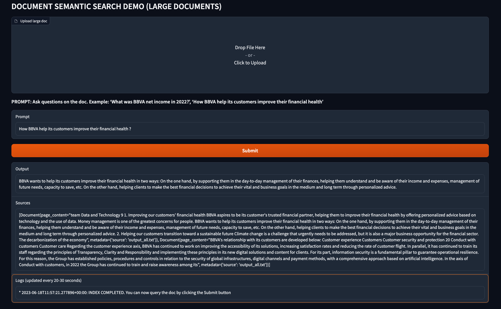

# Q&A with semantic answering on large scanned documents with Vertex AI LLM, Chroma, langChain and Document AI OCR

> This repo contains the code correspoding to this Medium article: [Generative AI — Q&A with semantic answering on large scanned documents with Vertex AI, Chroma, LangChain and Document AI OCR](https://medium.com/google-cloud/generative-ai-q-a-with-semantic-answering-on-large-scanned-documents-with-vertex-ai-chroma-7f4806a3cb71)

This repo shows how to make semantic question and answering over large scanned documents and pdfs, like mortgages, contracts or large finantial documents. The documents can be `pdf` or images in any of these [supported file formats](https://cloud.google.com/document-ai/docs/file-types). 

The repo includes a [Gradio app](https://gradio.app/) to ask large docs by showing the combined capabilities of Vertex LLM models, a vector store like [Chroma](https://github.com/chroma-core/chroma), [langChain](https://github.com/hwchase17/langchain) and [Google Cloud Document AI OCR](https://cloud.google.com/document-ai/docs/samples/documentai-process-ocr-document#documentai_process_ocr_document-python). So, basically this repo implements a semantic search on large and unstructured documents, by converting them to text first using the OCR engine of Document AI, and them implementing a retrieval augmented process with an LLM.

The sample used is the public 2022 BBVA annual report (in English), a 564-page pdf that can be downloaded from [here](https://shareholdersandinvestors.bbva.com/wp-content/uploads/2023/03/Annual-Report-BBVA_2022_ENG.pdf). You can replace this doc with any other, like mortgages or any other large documents in the Finance and Insurance industry, even if they contain images or scanned information. 
    



## Document AI OCR (batch processing)

The first step is to download the public document and uploading into GCS, since this is required for OCR batch processing. Refer to constant `gcs_input_uri` in `local/ocr_batch.py` and upload the pdf file in GCS.

Note also you need to create a Document AI OCR processor and replace the constants `project_id`, `region` and `processor_id`.

Why using Document AI OCR and not open-source tools like `PyPDF` to manage the document ? 

The reason is to be able also to process documents coming text from scanning or photos, since `PyPDF` and other similar tools will not detect text even if the extension is `.pdf`.

Therefore, to extract the text from a photo or a scanned documents, you must use OCR tools like Document AI OCR. [Google Cloud Document AI](https://cloud.google.com/document-ai/docs) is a document understanding solution that takes unstructured data (e.g. documents, emails, invoices, forms, etc.) and makes the data easier to understand, analyze, and consume. One of the pre-trained models performs **Optical Character Recognition (OCR)**, which is the one we will use in this post. According to [this paper](http://dx.doi.org/10.1007/s42001-021-00149-1), Document AI OCR from Google outperforms other OCR solutions available.

Document AI OCR parser supports **online and batch processing**. Since we are dealing with large documents (more than 15 pages, which is the current limit for online processing), we will be using batch mode.


The script `local/ocr_batch.py` extracts text from a public doc, in this case the English version of the 2002 BBVA annual report (publicly available), a document with 564 pages. Since the extraction by Document AI OCR is in multiple chunks, they must be merged in a single file `output_all.txt` which is also generated by the same script.

```sh
cd local
python3 ocr_batch.py
```


## Indexing and retrieval 

Once you get the OCR text `output_all.txt` from the first step, you must create the index in Chroma (note the store is done persistently), by executing `python3 create_index_chroma.py`:

```sh
python3 create_index_chroma.py
```

Once the index is built, you can launch the retrieval process. 

To launch the retrieval, launch `python3 retrieval_chroma.py`. This script uses **Retrieval QA chain** to recover the blocks closer to the query, and a Vertex LLM model (PaLM-2) to write the output to the user.

```sh
python3 retrieval_chroma.py
```

So, to summarize, you can run the full cycle locally by executing these steps (and modifying the constants):

```sh
# First step: run OCR
python3 python3 ocr_batch.py
# Second step: create Chroma index
python3 create_index_chroma.py
# Third step: query the document by launching the retrieval process
python3 retrieval_chroma.py
```


## End-to-end application in Gradio

The Gradio app will implement the full cycle described above in a single app:

1. Load a pdf file.
2. Perform **batch processing** with Document AI OCR parser.
3. Create the index with Chroma.
4. After 20-30 min depending on the doc size (batch processing in Document AI OCR consumes time), the user can then write the query, and the Retrieval QA chain will recover the blocks closer to the query. A Vertex LLM model will write the output to the user.
5. Make sure you refresh the indexes and select a document before making the query.

> NOTE: the full cycle described above can take up to 30 minutes before you can query the doc. Main time consumption is due to the Document AI OCR batch processing.

Refer to [this Medium post](https://medium.com/google-cloud/generative-ai-palm-2-model-deployment-with-cloud-run-54e8a398b24b) on how to set the Gradio app with minimum permissions. On top of those permissions, you will need the following roles for this app: `roles/logging.privateLogViewer`, `roles/storage.admin` (create buckets) and `roles/documentai.apiUser`. 

```sh
# extra roles required on top of minimum permissions
PROJECT_ID=<REPLACE_WITH_YOUR_PROJECT_ID>

# add logging.privateLogViewer role
gcloud projects add-iam-policy-binding $PROJECT_ID \
    --member="serviceAccount:cloud-run-llm@${PROJECT_ID}.iam.gserviceaccount.com" \
    --role="roles/logging.privateLogViewer"

# add documentai.apiUser role 
gcloud projects add-iam-policy-binding $PROJECT_ID \
    --member="serviceAccount:cloud-run-llm@${PROJECT_ID}.iam.gserviceaccount.com" \
    --role="roles/documentai.apiUser"

# add storage.admin role
gcloud projects add-iam-policy-binding $PROJECT_ID \
    --member="serviceAccount:cloud-run-llm@${PROJECT_ID}.iam.gserviceaccount.com" \
    --role="roles/storage.admin"
```

To build and deploy the [Gradio app](https://gradio.app/) in [Cloud Run](https://cloud.google.com/run/docs/quickstarts/deploy-container), execute the following commands. Note authentication is disabled and the service account is the one configured earlier:

```sh
PROJECT_ID=<REPLACE_WITH_YOUR_PROJECT_ID>
REGION=<REPLACE_WITH_YOUR_REGION>
AR_REPO=<REPLACE_WITH_YOUR_PAR_REPO>
SERVICE_NAME=docai-large

gcloud artifacts repositories create $AR_REPO --location=$REGION --repository-format=Docker
gcloud auth configure-docker $REGION-docker.pkg.dev
gcloud builds submit --tag $REGION-docker.pkg.dev/$PROJECT_ID/$AR_REPO/$SERVICE_NAME
gcloud run deploy $SERVICE_NAME --port 7860 --image $REGION-docker.pkg.dev/$PROJECT_ID/$AR_REPO/$SERVICE_NAME --service-account=cloud-run-llm@$PROJECT_ID.iam.gserviceaccount.com --allow-unauthenticated --region=europe-west4 --platform=managed  --project=$PROJECT_ID --memory=2G
```


## References

`[1]` Medium post: [Generative AI - PaLM-2 model deployment with Cloud Run](https://medium.com/google-cloud/generative-ai-palm-2-model-deployment-with-cloud-run-54e8a398b24b)      
`[2]` Paper: [Leveraging Passage Retrieval with Generative Models for Open Domain Question Answering](http://arxiv.org/abs/2007.01282)     
`[3]` Paper: [Retrieval-Augmented Generation for Knowledge-Intensive NLP Tasks](http://arxiv.org/abs/2005.11401)  
`[4]` YouTube video: [Generative AI on Google Cloud](https://youtu.be/Q1zF9pF6flw)     
`[5]` Documentation: [Google Cloud Document AI OCR](https://cloud.google.com/document-ai/docs/samples/documentai-process-ocr-document#documentai_process_ocr_document-python)        
`[6]` LangChain documentation: [Google Cloud Platform Vertex AI PaLM](https://python.langchain.com/docs/modules/model_io/models/llms/integrations/google_vertex_ai_palm)     
